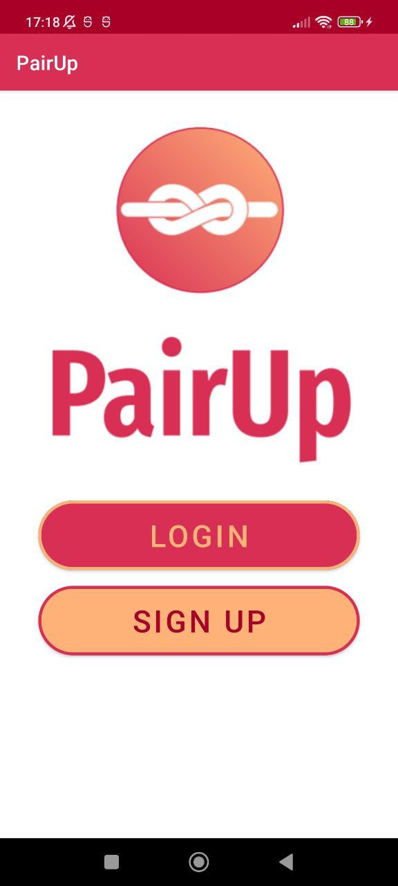
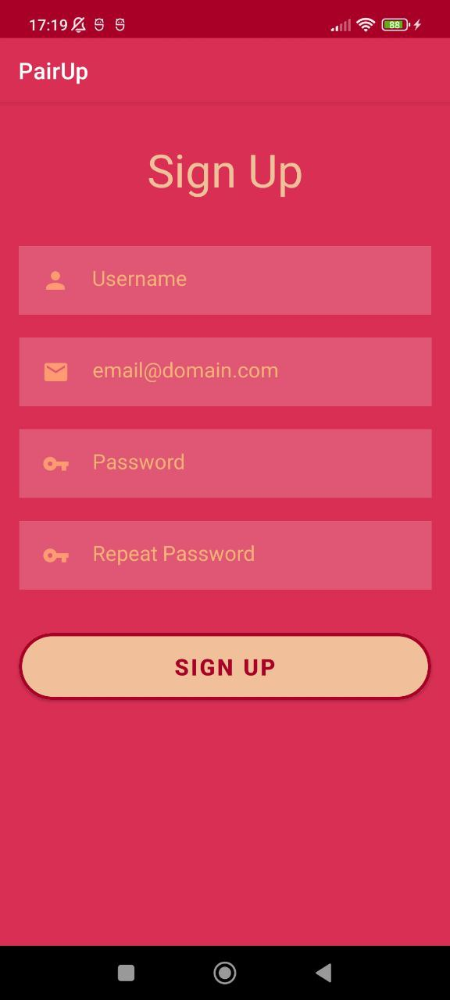
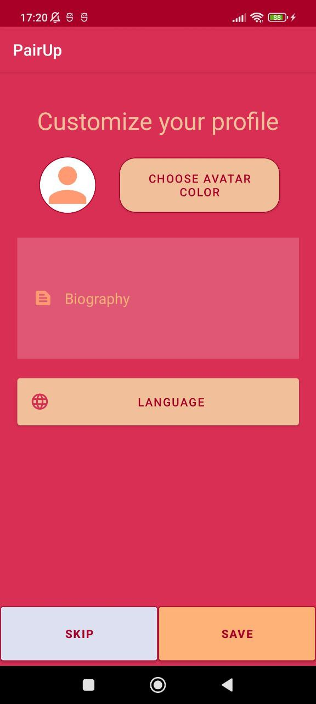
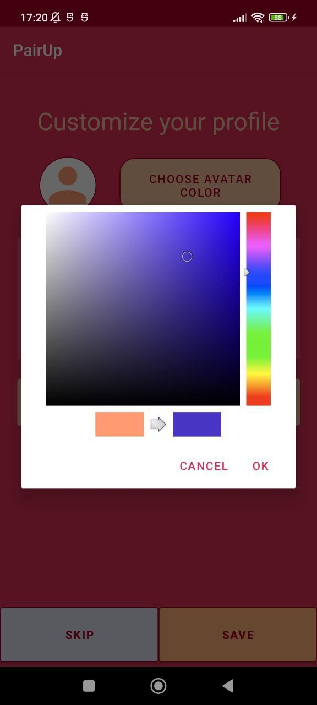
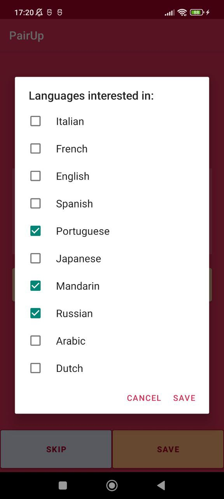
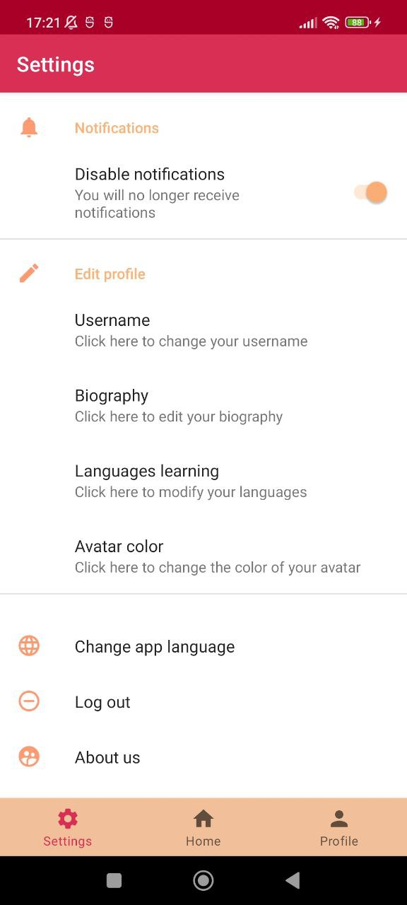
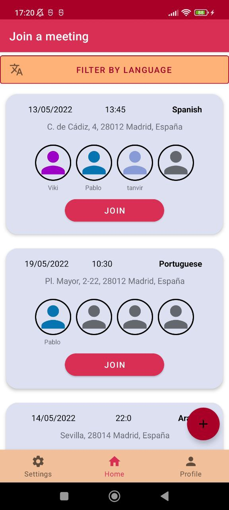
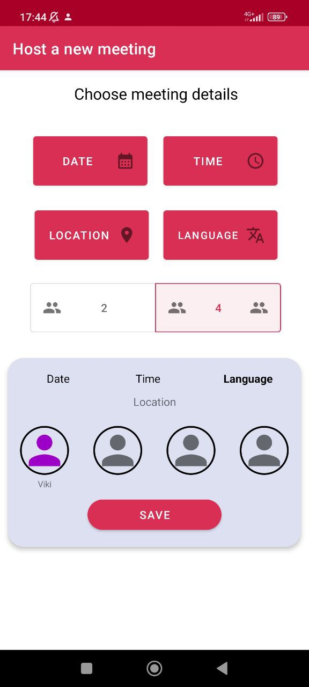
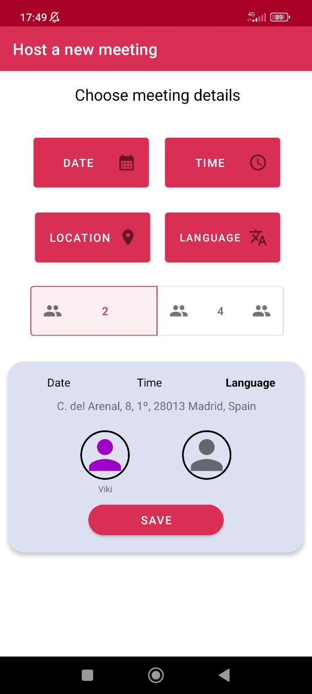
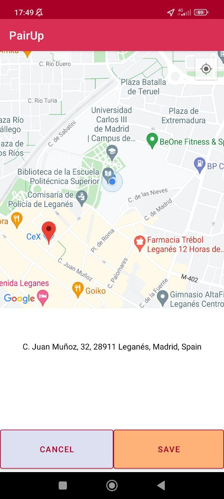

# PairUp

<table>
  <tr>
    <th>Main</th>
    <th>Login</th>
    <th>SignUp</th>
  </tr>
  <tr>
    <td></td>
    <td></td>
    <td></td>
  </tr>
 </table>
 
 After SignUp: Customize your profile
 <table>
  <tr>
    <td></td>
    <td></td>
    <td></td>
  </tr>
 </table>
 
 <table>
  <tr>
    <th>Settings</th>
    <th>Home</th>
    <th>Profile</th>
  </tr>
  <tr>
    <td></td>
    <td></td>
    <td></td>
  </tr>
 </table>
 Host an Event from Home Page +
 <table>
  <tr>
    <td></td>
    <td></td>
    <td></td>
  </tr>
 </table>

